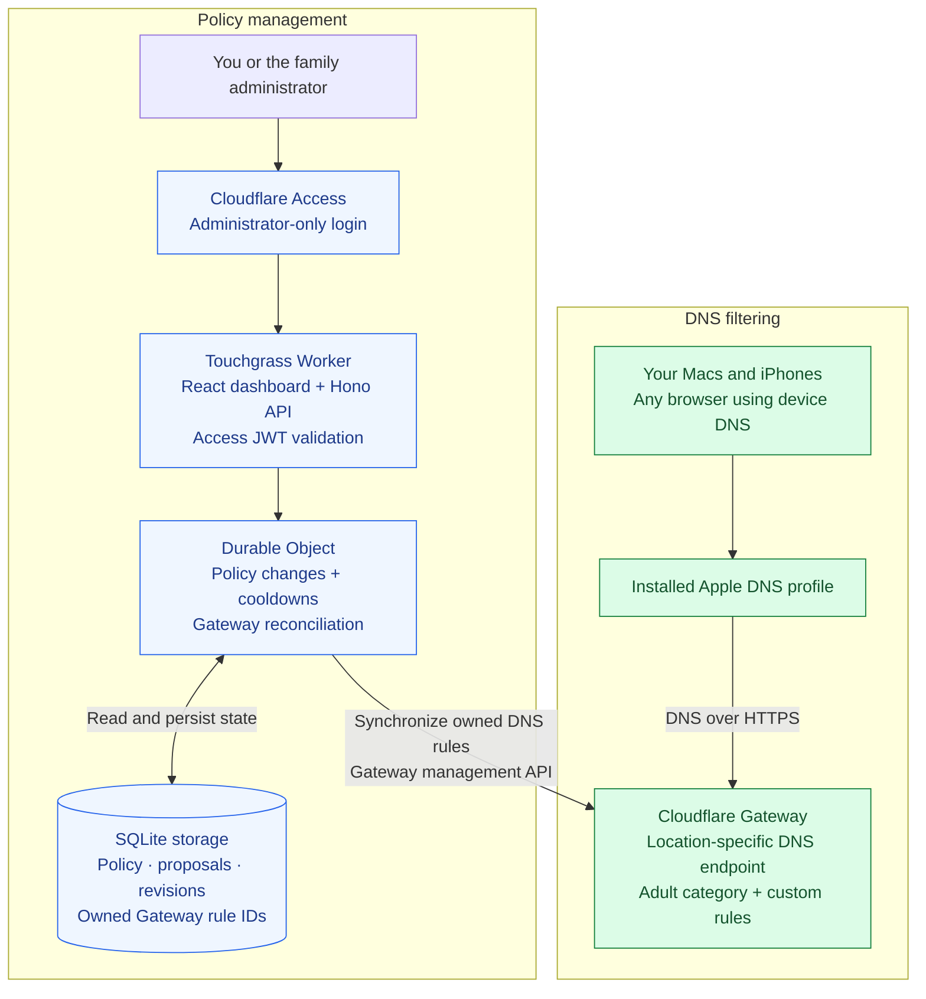
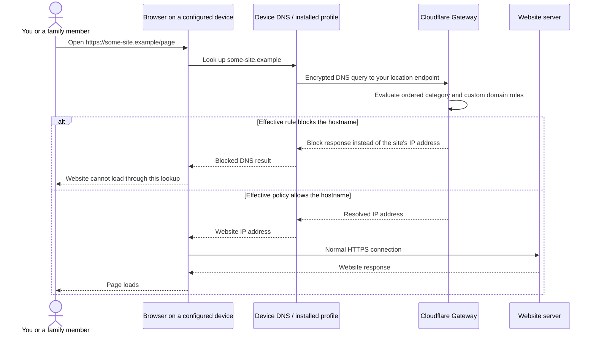

# Touchgrass

<p align="center">
  
</p>

**Free, self-hosted adult-site blocking for safer family browsing.**

## About

For individuals and families: block adult websites, add your own rules, and manage a shared
blocking policy from one private dashboard.
Touchgrass runs on your Cloudflare account and uses Cloudflare Gateway to filter DNS requests
before a blocked website can load.

**No app fees. No premium feature tiers. No per-device paywall.**

## Start with your AI assistant

Copy and paste this into your coding agent from any workspace:

```text
Clone https://github.com/fyzanshaik/touchgrass into a new folder, or reuse an existing clone. Read AGENTS.md, README.md, and skills/touchgrass-setup/SKILL.md, then explore the project, explain how it works, and guide me through setup for myself or my family. Reuse any existing deployment.
```

The repository is currently private, so the agent needs GitHub access to clone it. It will
use the project's guides and your own Cloudflare account. No special model or MCP connection
is required; it can guide you through manual login or device-installation steps. Never paste
API tokens or login cookies into chat.

[Get started](docs/setup.md) · [Architecture](#architecture) · [Blocking flow](#how-a-website-gets-blocked) · [Operations and recovery](docs/operations.md) · [MIT license](LICENSE)

## For you and your family

Set up Touchgrass once, then install its DNS profile on the iPhones and Macs you want to
filter. They use the same adult-site category and custom rules, managed by one administrator.

Touchgrass has **no app-imposed device limit**. There is no device registration, paid device
slot, or subscription required to unlock another installation. Cloudflare's service quotas
still apply; this is not a promise of unlimited infrastructure or traffic.

Set it up for yourself or your family: one adult manages the dashboard, and each family
member installs the DNS profile on their supported devices. Everyone gets the same adult-site
filter and custom blocklist, at home or on the go whenever their device uses that DNS profile.
Separate member policies, multiple administrators, and child-device lockdown are not included.

## What you get

| Feature | What it does |
| --- | --- |
| Adult-site blocking | Uses Cloudflare Gateway's pornography category to block classified domains. |
| Your own blocklist | Add a hostname or block a whole domain and its subdomains. |
| Allow rules | Add exceptions where they do not conflict with stronger blocks. |
| One private dashboard | Manage the shared policy behind an administrator-only Cloudflare Access login. |
| Cooldowns | Delay changes that weaken protection; strengthening changes take effect immediately after synchronization. |
| Backup and restore | Export your policy as JSON and restore it with the same cooldown rules. |
| Sync diagnostics | See whether Gateway has applied your latest policy, and investigate failed updates. |
| A free local preview | Try the dashboard with a simulated Gateway before configuring Cloudflare. |

## Why Touchgrass?

Useful blocking should not stop at a premium upgrade prompt. Touchgrass gives you category
filtering, custom rules, and policy management in one MIT-licensed project you can run yourself.

You control the configuration and Cloudflare account. The source is available to repository
readers, and the license allows them to reuse and modify it. While this repository is private,
cloning it requires GitHub access.

## Get started

You need a Cloudflare account, Node.js **22.18 or later**, and pnpm **11.9.0**. No native app,
App Store installation, or paid Apple Developer membership is needed.

### Try the dashboard locally

Replace `YOUR_REPOSITORY_URL` with the clone URL of a repository you can access:

```sh
git clone YOUR_REPOSITORY_URL touchgrass
cd touchgrass
npm install --global pnpm@11.9.0
pnpm install --frozen-lockfile
pnpm run dev:local
```

Open **http://127.0.0.1:8787**. This preview simulates Gateway and does not block websites,
change device DNS, or modify your Cloudflare account. Cooldowns use real time in the preview.

### Enable real blocking

Follow the [complete setup guide](docs/setup.md). It walks you through:

1. Creating a Cloudflare Gateway DNS location and copying its encrypted DNS endpoint.
2. Configuring your own Worker and an administrator-only Cloudflare Access login.
3. Storing the Gateway management token as a Worker secret.
4. Deploying the dashboard and confirming your policy has synchronized.
5. Generating and installing the DNS profile on each device.
6. Checking allowed sites and blocked domains in normal and private browsing.

The tracked configuration is a blank template. Your account values belong in an ignored
production configuration, and credentials stay in Worker secrets.

## Architecture

Touchgrass has two connected paths: **policy management**, where you decide what to block,
and **DNS filtering**, where Cloudflare Gateway applies that policy to your devices.
Both run in your Cloudflare account; devices use an installed DNS profile to reach Gateway.

### Component overview



| Component | Responsibility |
| --- | --- |
| Cloudflare Access | Restrict dashboard access to the configured administrator. |
| Worker | Serve the React dashboard, validate Access JWTs, and handle policy requests through the Hono API. |
| Durable Object + SQLite | Store the desired policy, pending cooldown proposals, revisions, and owned rule IDs; reconcile policy changes into Gateway. |
| Cloudflare Gateway | Resolve device DNS requests and enforce the synchronized adult-category and custom-domain rules. |
| Apple DNS profile | Configure eligible DNS lookups on each Mac or iPhone to use the deployment's Gateway endpoint. |

### From a saved rule to active protection

1. **Save the change.** The authenticated API sends it to the Durable Object. Stronger
   changes update the desired policy; weaker changes become proposals requiring confirmation
   after the cooldown.
2. **Synchronize Gateway.** The reconciler compiles the policy, updates only its owned
   Gateway rules, and confirms the applied revision after successful read-back. Diagnostics
   exposes synchronization errors and pending work.
3. **Filter device DNS.** Gateway evaluates queries from devices using the profile. The
   dashboard is not contacted for each lookup, and synchronization alone does not prove that
   a device is using the filtered resolver.

The Worker manages policy; **DNS requests go directly to Gateway**. Allowed website traffic
continues over normal HTTPS between the browser and website server. Touchgrass does not proxy
or inspect page content. The [blocking walkthrough below](#how-a-website-gets-blocked) shows
that request path in detail.

### Deployment boundaries

One deployment has **one administrator, one shared policy, and one Gateway location**.
An individual or family can use that same deployment across multiple supported devices.
Cloudflare supports location-based encrypted DNS filtering without its device client; see
[the DoH documentation](https://developers.cloudflare.com/cloudflare-one/networks/resolvers-and-proxies/dns/dns-over-https/).

Use a separate Cloudflare account for each independent deployment. The current Gateway rule
ownership namespace is account-wide, so separate Touchgrass instances cannot safely share
an account. Adding another family device reuses the existing deployment and profile endpoint.

## How a website gets blocked

When a browser needs an IP address for a website, its DNS request must reach your Gateway
endpoint for filtering to apply. Gateway evaluates the requested **hostname**, not the page's
URL path or content. This diagram shows a fresh DNS lookup through the installed profile:



The same principle applies to websites across browsers **when they use the configured DNS
path**. Cached DNS answers, existing connections, browser-specific secure DNS, VPNs, Private
Relay, or direct IP access can bypass a fresh filtered lookup. Touchgrass does not inspect or
intercept HTTPS page content. A page can also request resources from several other domains,
each of which has its own DNS decision. See Cloudflare’s
[DNS enforcement boundaries](https://developers.cloudflare.com/learning-paths/secure-internet-traffic/understand-policies/order-of-enforcement/).

The supplied profile and setup guide target **Mac and iPhone**. Gateway can filter other
DNS-capable devices if configured to use the same endpoint, but Touchgrass does not currently
provide installers or verified setup guides for every platform. Browser/device coverage and
adult-category coverage are separate: an unclassified adult domain may still need a custom
block even on a correctly configured device.

## Devices and browsers

The current setup targets **iPhone and Mac** using an installed Apple DNS profile.

| Device | Reference checks |
| --- | --- |
| Mac | Safari, Chrome, and Helium: allowed and blocked navigation checked directly in regular and private modes. |
| iPhone | Safari and Chrome: the owner reported blocking in normal/private modes, ordinary browsing, Wi-Fi/cellular operation, and persistence after restart. |

An installed profile normally survives a restart. A new browser, OS version, network, VPN,
or DNS override still needs its own check. A green dashboard confirms policy synchronization;
[device tests](docs/setup.md#step-14-test-devices-and-browsers) confirm the actual browsing path.

## Free software, your infrastructure

Touchgrass has no paid software tier and charges no fee for extra devices or custom rules.
It can be deployed using Cloudflare's Free services within their allowances.

Cloudflare sets the infrastructure limits. Workers requests, Durable Object usage/storage,
and Gateway account limits are not unlimited. DNS queries go to Gateway rather than counting
as individual Touchgrass dashboard requests. Check the current
[Workers pricing](https://developers.cloudflare.com/workers/platform/pricing/) and
[Cloudflare One account limits](https://developers.cloudflare.com/cloudflare-one/account-limits/)
before deploying. Touchgrass never upgrades a plan or purchases an add-on for you.

The application currently supports up to **1,000 custom policy rules**. Actual capacity also
depends on Cloudflare's policy and expression limits. The absence of a paywall does not mean
unbounded rules or guaranteed coverage of every adult domain.

## Know the boundaries

- **It filters domains.** It cannot distinguish an adult post from another post on Reddit,
  X, or any other shared website. It also does not add broader child-safety categories or
  SafeSearch enforcement automatically.
- **Category coverage is imperfect.** Newly created or unclassified adult domains may need
  a custom block. A few successful tests do not prove universal coverage.
- **The profile is removable.** A device user can remove it or choose another resolver.
  VPNs, browser-specific secure DNS, and iCloud Private Relay can change routing. Cooldowns
  govern dashboard changes, not device settings or direct Cloudflare account edits.
- **Cloudflare is the DNS provider.** DNS transport is encrypted, but Cloudflare can see
  queried domain names and may log them according to your account settings. Self-hosting
  the dashboard does not make DNS queries invisible to the provider.

Touchgrass helps establish a shared adult-site blocking baseline. It does not guarantee a
completely child-safe internet or tamper-proof parental controls.

## Manage and recover

Use the dashboard to add rules, review pending changes, and export backups. Weakening changes
require confirmation after the configured cooldown, which defaults to **24 hours** and can be
set from **0 to 7 days**. Restoring a backup cannot bypass it.

If blocking stops, check the device profile and resolver path before changing the backend.
If policy synchronization fails, use Diagnostics to inspect the error and owned rules.
The [operations guide](docs/operations.md) covers both, along with token rotation, precedence
conflicts, privacy, and upgrades.

## Development

Built with **TypeScript, Effect, Hono, React, Vite, Cloudflare Workers, and a SQLite-backed
Durable Object**.

```sh
pnpm install --frozen-lockfile
pnpm run verify
```

Verification checks strict TypeScript and source rules, runs domain/profile/dashboard/Worker
runtime tests, builds the dashboard, and dry-runs the Worker bundle. GitHub Actions runs the
same pipeline without deployment credentials. Passing it verifies the code, not your device's
DNS configuration.

For dashboard development, run `pnpm run dev:web` alongside `pnpm run dev:local`.

| Directory | Contents |
| --- | --- |
| `src/domain/` | Policy, hostname validation, cooldown classification, and rule compilation |
| `src/contracts/` | Shared Effect Schema API contracts |
| `src/worker/` | Authentication, API, Durable Object storage, and Gateway reconciliation |
| `src/web/` | Dashboard |
| `src/dns-profile/` | Apple DNS profile generation |
| `tests/` | Domain, profile, dashboard, and Worker runtime tests |
| `docs/` | Setup and operations guides |
| `skills/` | [Portable setup, architecture, and recovery skills](skills/README.md) for AI assistants |

Contributions must preserve strict types, decode external input from `unknown`, and add no
source comments, `any`, unchecked assertions, or suppression directives. See [AGENTS.md](AGENTS.md)
for the project conventions. Keep credentials and local account settings out of commits.

## License

[MIT](LICENSE). Free to use, modify, and distribute under the license terms.
